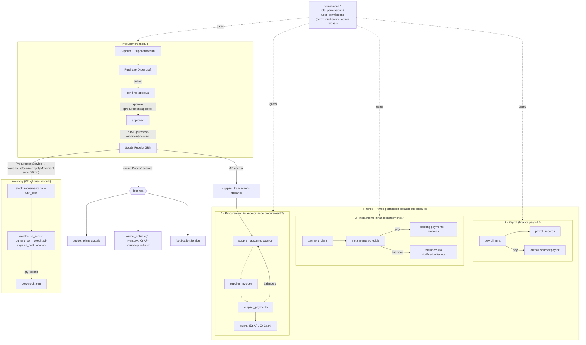

# Procurement–Inventory Integration & Finance Module Decomposition

Design document, 2026-07-12. Grounded in the existing codebase:

- **Inventory = Warehouse module** (`warehouse_items`, `stock_movements`, `WarehouseService::applyMovement()` which already handles qty-before/after, negative-stock guard, low-stock alerts, audit logging inside a DB transaction).
- **Student Management pattern to mirror**: entity table (`student_profiles`) FK'd to a parent record, relation tables (`parent_student`), reference-number generation (`ADM-…`), role-scoped route groups, fat per-module API controller, service class for write logic.
- **Auth today**: single `users.role` string (`admin, teacher, student, parent, finance, hr, warehouse`) + `RoleMiddleware`. No permissions table.
- **DB drivers**: PostgreSQL in production (Railway), SQLite in tests — all schema/SQL below is portable (no enum ALTERs on existing columns; new "enum" columns use `string` + app-level validation, matching `invoices.status` / `payroll_records.status` convention).

---

## 1. Procurement module — DB schema

One new migration: `2026_07_12_000001_create_procurement_module.php` (additive only).

```php
<?php

use Illuminate\Database\Migrations\Migration;
use Illuminate\Database\Schema\Blueprint;
use Illuminate\Support\Facades\Schema;

return new class extends Migration
{
    public function up(): void
    {
        // Entity layer — mirrors student_profiles pattern (code = admission_no analogue)
        Schema::create('suppliers', function (Blueprint $t) {
            $t->id();
            $t->string('code')->unique();              // SUP-2026-0001 (WarehouseService::generateRef)
            $t->string('name');
            $t->string('contact_person')->nullable();
            $t->string('phone');
            $t->string('secondary_phone')->nullable();
            $t->string('email')->nullable();
            $t->text('address')->nullable();
            $t->string('tax_number')->nullable();
            $t->boolean('is_active')->default(true);
            $t->timestamps();
            $t->softDeletes();                          // keep history when supplier is retired

            $t->index(['is_active']);
        });

        // One account per supplier — like student_profiles : users (1:1, unique FK)
        Schema::create('supplier_accounts', function (Blueprint $t) {
            $t->id();
            $t->foreignId('supplier_id')->unique()->constrained('suppliers')->cascadeOnDelete();
            $t->decimal('balance', 14, 2)->default(0); // positive = we owe the supplier (AP)
            $t->decimal('credit_limit', 14, 2)->nullable();
            $t->string('payment_terms')->default('net_30'); // cash, net_15, net_30, net_60
            $t->text('notes')->nullable();
            $t->timestamps();
        });

        // Ledger of everything that touches the balance (mirrors stock_movements'
        // qty_before/qty_after convention with balance_after)
        Schema::create('supplier_transactions', function (Blueprint $t) {
            $t->id();
            $t->foreignId('supplier_account_id')->constrained('supplier_accounts')->cascadeOnDelete();
            $t->string('type');                        // invoice, payment, credit_note, adjustment
            $t->decimal('amount', 14, 2);              // signed: invoice +, payment -
            $t->decimal('balance_after', 14, 2);
            $t->string('reference_no')->nullable();    // PO no / invoice no / payment ref
            $t->string('source_type')->nullable();     // App\Models\SupplierInvoice, SupplierPayment
            $t->unsignedBigInteger('source_id')->nullable();
            $t->string('description')->nullable();
            $t->foreignId('performed_by')->nullable()->constrained('users')->nullOnDelete();
            $t->timestamp('transaction_date');
            $t->timestamps();

            $t->index(['supplier_account_id', 'transaction_date']);
            $t->index(['source_type', 'source_id']);
        });

        Schema::create('purchase_orders', function (Blueprint $t) {
            $t->id();
            $t->string('po_no')->unique();             // PO-2026-0001
            $t->foreignId('supplier_id')->constrained('suppliers');
            // draft, pending_approval, approved, partially_received, received, closed, cancelled
            $t->string('status')->default('draft');
            $t->date('order_date');
            $t->date('expected_date')->nullable();
            $t->decimal('subtotal', 14, 2)->default(0);
            $t->decimal('tax', 14, 2)->default(0);
            $t->decimal('total', 14, 2)->default(0);
            $t->text('notes')->nullable();
            // Link back to the legacy warehouse purchase_requests workflow (optional)
            $t->foreignId('purchase_request_id')->nullable()
                ->constrained('purchase_requests')->nullOnDelete();
            $t->foreignId('requested_by')->constrained('users');
            $t->foreignId('approved_by')->nullable()->constrained('users')->nullOnDelete();
            $t->timestamp('approved_at')->nullable();
            $t->timestamps();
            $t->softDeletes();

            $t->index(['status']);
            $t->index(['supplier_id', 'status']);
        });

        Schema::create('purchase_order_items', function (Blueprint $t) {
            $t->id();
            $t->foreignId('purchase_order_id')->constrained('purchase_orders')->cascadeOnDelete();
            $t->foreignId('warehouse_item_id')->constrained('warehouse_items');
            $t->string('description')->nullable();     // free-text override of item name
            $t->decimal('quantity_ordered', 10, 2);
            $t->decimal('quantity_received', 10, 2)->default(0);
            $t->string('unit');
            $t->decimal('unit_cost', 12, 2);
            $t->decimal('line_total', 14, 2);
            $t->string('warehouse_location')->nullable(); // target location on receipt
            $t->timestamps();

            $t->index(['purchase_order_id']);
            $t->index(['warehouse_item_id']);
        });

        // Goods Receipt Note — the event that actually moves inventory
        Schema::create('goods_receipts', function (Blueprint $t) {
            $t->id();
            $t->string('grn_no')->unique();            // GRN-2026-0001
            $t->foreignId('purchase_order_id')->constrained('purchase_orders');
            $t->string('status')->default('posted');   // draft, posted
            $t->text('notes')->nullable();
            $t->foreignId('received_by')->constrained('users');
            $t->timestamp('received_at');
            $t->timestamps();

            $t->index(['purchase_order_id']);
        });

        Schema::create('goods_receipt_items', function (Blueprint $t) {
            $t->id();
            $t->foreignId('goods_receipt_id')->constrained('goods_receipts')->cascadeOnDelete();
            $t->foreignId('purchase_order_item_id')->constrained('purchase_order_items');
            $t->decimal('quantity_received', 10, 2);
            $t->decimal('unit_cost', 12, 2);           // actual landed cost (may differ from PO)
            // audit link to the inventory movement this line produced
            $t->foreignId('stock_movement_id')->nullable()
                ->constrained('stock_movements')->nullOnDelete();
            $t->timestamps();
        });
    }

    public function down(): void
    {
        Schema::dropIfExists('goods_receipt_items');
        Schema::dropIfExists('goods_receipts');
        Schema::dropIfExists('purchase_order_items');
        Schema::dropIfExists('purchase_orders');
        Schema::dropIfExists('supplier_transactions');
        Schema::dropIfExists('supplier_accounts');
        Schema::dropIfExists('suppliers');
    }
};
```

### 1b. Inventory-side additions

`2026_07_12_000002_add_costing_to_warehouse.php` — nullable/additive so existing rows and code are untouched.

```php
public function up(): void
{
    Schema::table('warehouse_items', function (Blueprint $t) {
        $t->decimal('unit_cost', 12, 2)->nullable()->after('min_stock_qty');      // weighted avg
        $t->decimal('last_unit_cost', 12, 2)->nullable()->after('unit_cost');
        $t->foreignId('preferred_supplier_id')->nullable()
            ->constrained('suppliers')->nullOnDelete();
    });

    Schema::table('stock_movements', function (Blueprint $t) {
        $t->decimal('unit_cost', 12, 2)->nullable()->after('quantity');
        $t->foreignId('purchase_order_id')->nullable()
            ->constrained('purchase_orders')->nullOnDelete();
    });
}

public function down(): void
{
    Schema::table('stock_movements', function (Blueprint $t) {
        $t->dropConstrainedForeignId('purchase_order_id');
        $t->dropColumn('unit_cost');
    });
    Schema::table('warehouse_items', function (Blueprint $t) {
        $t->dropConstrainedForeignId('preferred_supplier_id');
        $t->dropColumn(['unit_cost', 'last_unit_cost']);
    });
}
```

> Note (project convention): adding **new nullable columns** via `Schema::table` is safe on both drivers. Only *altering* existing columns is what SQLite can't do — that stays out of this design entirely, except journal `source` (see §3c).

### 1c. Integration logic — `ProcurementService`

New `app/Services/ProcurementService.php`, following `WarehouseService` style (constructor-injected `NotificationService` + `AuditLogger`, everything in `DB::transaction`). It **reuses** `WarehouseService::applyMovement()` rather than duplicating stock math:

```
postGoodsReceipt(PurchaseOrder $po, array $lines, User $actor): GoodsReceipt
  DB::transaction:
    1. guard: $po->status in [approved, partially_received]
    2. create goods_receipts (grn_no = generateRef('GRN', GoodsReceipt::class))
    3. per line:
       a. guard: qty_received + already_received <= quantity_ordered
       b. movement = warehouseService->applyMovement($item, [
              movement_type: 'in', quantity, unit_cost,
              reference_no: grn_no, supplier: $po->supplier->name,
              purchase_order_id: $po->id ], $actor)
       c. update warehouse_items: last_unit_cost = line cost,
          unit_cost = weighted average ((old_qty*old_cost + qty*cost) / new_qty),
          location = line->warehouse_location ?? existing
       d. increment purchase_order_items.quantity_received
       e. store goods_receipt_items row w/ stock_movement_id
    4. po->status = all lines fully received ? 'received' : 'partially_received'
    5. postSupplierInvoiceAccrual($po, $receiptTotal)   // supplier_transactions 'invoice',
                                                        // balance += receipt total
    6. event(new GoodsReceived($grn))                   // decoupled listeners below
```

`app/Events/GoodsReceived.php` + listeners (registered in `AppServiceProvider`):

- `SyncBudgetActuals` — bumps `budget_plans.actual_amount` (reuses `BudgetService`).
- `PostProcurementJournal` — writes the double entry via `JournalService`
  (debit *Inventory/Expense* account, credit *Accounts Payable*), `source = 'purchase'`, `source_id = grn id`.
- `NotifyProcurement` — `NotificationService::sendToMany` to `procurement` + `admin` roles.

This is the "webhook/event" of the requirement: internal consumers use the event; if an external
system needs it later, add one listener that POSTs the GRN payload to a configured URL — no schema change.

**PO approval** (`POST /procurement/purchase-orders/{id}/approve`) does *not* move stock (goods aren't
physically there yet); it flips status → `approved` and notifies warehouse. Stock and cost update at
**goods receipt** time, which also covers partial deliveries. Receiving without prior approval is rejected.

---

## 2. Permission system (foundation for the Finance split)

Keep `users.role` (nothing in the existing app breaks) and layer granular permissions on top.
Migration `2026_07_12_000003_create_permissions_tables.php`:

```php
public function up(): void
{
    Schema::create('permissions', function (Blueprint $t) {
        $t->id();
        $t->string('key')->unique();     // e.g. finance.installments.approve
        $t->string('module');            // procurement | finance.procurement | finance.installments | finance.payroll
        $t->string('action');            // view | create | edit | delete | approve
        $t->string('description')->nullable();
        $t->timestamps();
    });

    Schema::create('role_permissions', function (Blueprint $t) {
        $t->id();
        $t->string('role');              // matches users.role values
        $t->foreignId('permission_id')->constrained('permissions')->cascadeOnDelete();
        $t->timestamps();

        $t->unique(['role', 'permission_id']);
        $t->index(['role']);
    });

    // Per-user overrides (grant or revoke a single permission without a new role)
    Schema::create('user_permissions', function (Blueprint $t) {
        $t->id();
        $t->foreignId('user_id')->constrained('users')->cascadeOnDelete();
        $t->foreignId('permission_id')->constrained('permissions')->cascadeOnDelete();
        $t->boolean('granted')->default(true);   // false = explicit deny overriding role grant
        $t->timestamps();

        $t->unique(['user_id', 'permission_id']);
    });
}
```

### Permission keys (seeded by `PermissionSeeder`)

`{module}.{action}` with actions `view, create, edit, delete, approve` per module
(procurement additionally has `receive`, so GRN posting can be granted separately from PO approval):

| Module key | Covers |
|---|---|
| `procurement` | suppliers, supplier accounts, POs (`approve` = approve/cancel PO; `receive` = post GRN) |
| `finance.procurement` | supplier invoices, supplier payments, AP aging (`approve` = release payment) |
| `finance.installments` | payment plans, installments, reminders (`approve` = waive/cancel plan) |
| `finance.payroll` | payroll runs & records (`approve` = approve/pay run) |

= 21 permission rows. Existing modules (academics, warehouse, HR…) stay on `RoleMiddleware`; they can be folded in later using the same table without another schema change.

### Enforcement

- `app/Http/Middleware/PermissionMiddleware.php`, alias **`perm:`** (registered in `bootstrap/app.php` beside `role:`). Logic: `admin` passes always; otherwise pass iff (role grant ∪ user grant) − user denies contains the key. Grants cached per role for 5 min (`Cache::remember("perms.role.{$role}")`, busted on write).
- `User::hasPermission(string $key): bool` helper for controller-level checks.
- `GET /auth/me` response gains a `permissions: string[]` field so the React frontend can gate UI per sub-module.

### Role → permission mapping (seeded; preserves current behaviour exactly)

| Permission set | admin | finance (Accountant) | procurement (new role) | hr | warehouse |
|---|---|---|---|---|---|
| `procurement.view/create/edit` | ✅ (implicit) | view only | ✅ | — | view |
| `procurement.delete` | ✅ | — | ✅ | — | — |
| `procurement.approve` (approve/cancel PO) | ✅ | — | ✅* | — | — |
| `procurement.receive` (post GRN → stock in) | ✅ | — | ✅ | — | ✅ |
| `finance.procurement.*` | ✅ | ✅ all | view, create (invoices) | — | — |
| `finance.installments.*` | ✅ | ✅ all | — | — | — |
| `finance.payroll.view/create/edit` | ✅ | ✅ | — | ✅ | — |
| `finance.payroll.delete/approve` | ✅ | ✅ | — | — | — |

\* Optionally withhold `procurement.approve` from the officer who *creates* POs and reserve it for admin — the schema supports either; the admin `PUT /roles/{role}/permissions` endpoint changes it without a deploy.

New role value **`procurement`** is just a new string in `users.role` — no schema change (column is already `string` with an index).

---

## 3. Finance decomposition — DB schema

### 3a. Installments — `2026_07_12_000004_create_installments_module.php`

```php
Schema::create('payment_plans', function (Blueprint $t) {
    $t->id();
    $t->string('plan_no')->unique();               // PLAN-2026-0001
    $t->foreignId('student_user_id')->constrained('users')->cascadeOnDelete();
    $t->foreignId('invoice_id')->nullable()->constrained('invoices')->nullOnDelete();
    $t->decimal('total_amount', 12, 2);
    $t->decimal('down_payment', 12, 2)->default(0);
    $t->unsignedTinyInteger('num_installments');
    $t->string('frequency')->default('monthly');   // monthly, quarterly
    $t->date('start_date');
    $t->string('status')->default('active');       // active, completed, defaulted, cancelled
    $t->foreignId('created_by')->constrained('users');
    $t->foreignId('approved_by')->nullable()->constrained('users')->nullOnDelete();
    $t->timestamps();
    $t->softDeletes();

    $t->index(['student_user_id', 'status']);
});

Schema::create('installments', function (Blueprint $t) {
    $t->id();
    $t->foreignId('payment_plan_id')->constrained('payment_plans')->cascadeOnDelete();
    $t->unsignedTinyInteger('sequence_no');
    $t->date('due_date');
    $t->decimal('amount', 12, 2);
    $t->decimal('paid_amount', 12, 2)->default(0);
    $t->string('status')->default('pending');      // pending, partial, paid, overdue, waived
    $t->foreignId('payment_id')->nullable()->constrained('payments')->nullOnDelete();
    $t->timestamp('paid_at')->nullable();
    $t->timestamp('reminder_sent_at')->nullable();
    $t->timestamps();

    $t->unique(['payment_plan_id', 'sequence_no']);
    $t->index(['status', 'due_date']);             // reminder scan
});
```

Existing `invoices`/`payments` are **untouched**; an installment payment is recorded through the
existing `FinanceController::recordPayment` flow and linked via `installments.payment_id`.
Reminders: scheduled command `installments:send-reminders` (in `routes/console.php`, like existing
schedules) selects `status in (pending, partial) and due_date <= today+3` and reuses
`NotificationService` templates (`installment_due`, `installment_overdue`).

### 3b. Procurement Finance (AP) — `2026_07_12_000005_create_procurement_finance_module.php`

```php
Schema::create('supplier_invoices', function (Blueprint $t) {
    $t->id();
    $t->string('invoice_no')->unique();            // SINV-2026-0001
    $t->string('supplier_invoice_ref')->nullable();// the supplier's own number
    $t->foreignId('supplier_id')->constrained('suppliers');
    $t->foreignId('purchase_order_id')->nullable()->constrained('purchase_orders')->nullOnDelete();
    $t->date('invoice_date');
    $t->date('due_date');
    $t->decimal('amount', 14, 2);
    $t->decimal('paid_amount', 14, 2)->default(0);
    $t->string('status')->default('pending');      // pending, partial, paid, overdue, cancelled
    $t->text('notes')->nullable();
    $t->foreignId('created_by')->constrained('users');
    $t->timestamps();
    $t->softDeletes();

    $t->index(['supplier_id', 'status']);
    $t->index(['status', 'due_date']);             // AP aging
});

Schema::create('supplier_payments', function (Blueprint $t) {
    $t->id();
    $t->foreignId('supplier_invoice_id')->constrained('supplier_invoices')->cascadeOnDelete();
    $t->decimal('amount', 14, 2);
    $t->string('method');                          // cash, bank_transfer, cheque
    $t->string('reference')->nullable();
    $t->foreignId('recorded_by')->constrained('users');
    $t->foreignId('approved_by')->nullable()->constrained('users')->nullOnDelete();
    $t->timestamp('paid_at');
    $t->text('note')->nullable();
    $t->timestamps();

    $t->index(['supplier_invoice_id']);
});
```

Write path (`ProcurementFinanceService`, mirrors invoice/payment logic in `FinanceController`):
recording a payment updates `supplier_invoices.paid_amount`/`status`, appends a
`supplier_transactions` row (`type = payment`, amount negative, `balance_after` recomputed),
decrements `supplier_accounts.balance`, and posts the journal entry (debit AP, credit Cash/Bank).

### 3c. Payroll — `2026_07_12_000006_create_payroll_runs.php`

Existing `payroll_records` keeps all data; a run header adds the approval workflow:

```php
Schema::create('payroll_runs', function (Blueprint $t) {
    $t->id();
    $t->string('run_no')->unique();                // RUN-2026-07
    $t->integer('year');
    $t->tinyInteger('month');
    $t->string('status')->default('draft');        // draft, processed, approved, paid
    $t->decimal('total_gross', 14, 2)->default(0);
    $t->decimal('total_deductions', 14, 2)->default(0);
    $t->decimal('total_net', 14, 2)->default(0);
    $t->foreignId('processed_by')->nullable()->constrained('users')->nullOnDelete();
    $t->foreignId('approved_by')->nullable()->constrained('users')->nullOnDelete();
    $t->timestamp('approved_at')->nullable();
    $t->timestamps();

    $t->unique(['year', 'month']);
});

Schema::table('payroll_records', function (Blueprint $t) {
    $t->foreignId('payroll_run_id')->nullable()    // nullable = legacy records stay valid
        ->constrained('payroll_runs')->nullOnDelete();
});
```

Backfill (in the same migration's `up()`, after schema): create one `payroll_runs` row per distinct
`(year, month)` in `payroll_records` with `status = 'paid'` and link records —
plain portable Eloquent/Query Builder loops, no raw driver-specific SQL.

### 3d. Journal `source` values

`journal_entries.source` is a real enum in the base accounting migration
(`manual, invoice, payroll, expense`). New sources needed: `purchase`, `supplier_payment`,
`installment`. Per this project's established convention for column alters that SQLite can't do:
**edit the base migration** `2026_05_05_000001_create_accounting_module.php` to declare
`$t->string('source')->default('manual');` (tests/CI rebuild from scratch), and add one tiny
driver-guarded migration for the live Postgres DB:

```php
public function up(): void
{
    if (DB::getDriverName() === 'pgsql') {
        DB::statement('ALTER TABLE journal_entries DROP CONSTRAINT IF EXISTS journal_entries_source_check');
        DB::statement('ALTER TABLE journal_entries ALTER COLUMN source TYPE varchar(255)');
    }
    // sqlite: base migration already declares string — nothing to do
}
```

---

## 4. API endpoints

Conventions kept: fat per-module controller in `App\Http\Controllers\Api`, `auth:sanctum` group,
JSON `{ message }` errors, `AuditLogger` on writes, PDF variants via existing report pattern.
New middleware alias `perm:` used **alongside** a permissive `role:` gate during transition (§6).

### 4a. Procurement — `ProcurementController` (prefix `/api/procurement`)

| Method & path | Permission | Purpose / body |
|---|---|---|
| `GET /suppliers` | `procurement.view` | paginated; filters `q`, `is_active` |
| `POST /suppliers` | `procurement.create` | `{name, contact_person?, phone, secondary_phone?, email?, address?, tax_number?, payment_terms?}` → creates supplier **and** its `supplier_accounts` row (like user+profile creation in AdminController) |
| `GET /suppliers/{id}` | `procurement.view` | supplier + account + last 20 transactions |
| `PATCH /suppliers/{id}` | `procurement.edit` | partial update (incl. account payment_terms/credit_limit) |
| `DELETE /suppliers/{id}` | `procurement.delete` | soft delete; 409 if open POs/invoices |
| `GET /suppliers/{id}/transactions` | `procurement.view` | paginated ledger |
| `GET /purchase-orders` | `procurement.view` | filters `status`, `supplier_id`, date range |
| `POST /purchase-orders` | `procurement.create` | `{supplier_id, order_date, expected_date?, notes?, purchase_request_id?, items: [{warehouse_item_id, quantity_ordered, unit, unit_cost, warehouse_location?}]}` → status `draft`, totals computed server-side |
| `GET /purchase-orders/{id}` | `procurement.view` | PO + items + receipts |
| `PATCH /purchase-orders/{id}` | `procurement.edit` | only while `draft`/`pending_approval` |
| `POST /purchase-orders/{id}/submit` | `procurement.edit` | `draft → pending_approval`, notifies approvers |
| `POST /purchase-orders/{id}/approve` | `procurement.approve` | `→ approved` (or `{action:'reject', reason}` → back to `draft`) |
| `POST /purchase-orders/{id}/cancel` | `procurement.approve` | any pre-received status → `cancelled` |
| `POST /purchase-orders/{id}/receive` | `procurement.approve` | **the inventory sync entry point** — `{notes?, lines: [{purchase_order_item_id, quantity_received, unit_cost?, warehouse_location?}]}` → `ProcurementService::postGoodsReceipt` (stock in, cost update, AP accrual, `GoodsReceived` event). Response: GRN + per-line `stock_movement_id` + new item quantities |
| `GET /goods-receipts` / `GET /goods-receipts/{id}` | `procurement.view` | receipt history |
| `GET /dashboard` | `procurement.view` | open POs, pending approvals, monthly spend, top suppliers |

Response shape follows existing modules: `{ data: [...], meta: {...} }` for lists (Laravel paginator), bare object for single resources.

### 4b. Procurement Finance (AP) — `ProcurementFinanceController` (prefix `/api/finance/ap`)

| Method & path | Permission |
|---|---|
| `GET /supplier-invoices` (filters: status, supplier, overdue) | `finance.procurement.view` |
| `POST /supplier-invoices` `{supplier_id, purchase_order_id?, supplier_invoice_ref?, invoice_date, due_date, amount}` | `finance.procurement.create` |
| `GET /supplier-invoices/{id}` · `PATCH` (pre-payment only) · `DELETE` (cancel) | view / edit / delete |
| `POST /supplier-invoices/{id}/payments` `{amount, method, reference?, paid_at?}` | `finance.procurement.approve` |
| `GET /reports/ap-aging` (+ `/pdf`) — buckets current/30/60/90 by supplier | `finance.procurement.view` |

### 4c. Installments — `InstallmentController` (prefix `/api/finance/installments`)

| Method & path | Permission |
|---|---|
| `GET /plans` (filters: status, student, class) | `finance.installments.view` |
| `POST /plans` `{student_user_id, invoice_id?, total_amount, down_payment?, num_installments, frequency, start_date}` → generates the `installments` schedule rows | `finance.installments.create` |
| `GET /plans/{id}` · `PATCH /plans/{id}` (reschedule unpaid rows) | view / edit |
| `POST /plans/{id}/cancel` · `POST /installments/{id}/waive` | `finance.installments.approve` |
| `POST /installments/{id}/pay` `{amount, method, reference?}` → creates `payments` row + links | `finance.installments.create` |
| `GET /due` — due within N days + overdue | `finance.installments.view` |
| `POST /send-reminders` (manual trigger of the scheduled job) | `finance.installments.edit` |

Read-only exposure to parents (`/parent/children/{id}/installments`) reuses `EnsureParentOwnsChild` — no new permission needed.

### 4d. Payroll — `PayrollController` (prefix `/api/finance/payroll`)

| Method & path | Permission |
|---|---|
| `GET /runs` · `GET /runs/{id}` (run + records) | `finance.payroll.view` |
| `POST /runs` `{year, month}` → drafts records for active staff (reuses `FinanceController::processPayroll` logic) | `finance.payroll.create` |
| `PATCH /records/{id}` (adjust allowances/deductions while run is draft) | `finance.payroll.edit` |
| `POST /runs/{id}/process` → totals frozen, `→ processed` | `finance.payroll.edit` |
| `POST /runs/{id}/approve` → `approved` | `finance.payroll.approve` |
| `POST /runs/{id}/pay` → all records `paid`, journal posted (`source='payroll'`) | `finance.payroll.approve` |
| `GET /reports/monthly` (+ `/pdf`) | `finance.payroll.view` |

**Legacy routes** `/finance/payroll`, `/finance/payroll/process`, `/finance/payroll/{id}/pay` stay
mounted and delegate to `PayrollController` so the deployed React/mobile clients keep working (§6).

### 4e. Permission admin — additions to `AdminController` (prefix `/api/admin`)

| Method & path | Purpose |
|---|---|
| `GET /permissions` | all permission keys grouped by module |
| `GET /roles/{role}/permissions` · `PUT /roles/{role}/permissions` `{keys: string[]}` | inspect / replace a role's grants (cache-busting) |
| `PUT /users/{id}/permissions` `{grants: string[], denies: string[]}` | per-user overrides |

### Routes file sketch

```php
// routes/api.php — inside the auth:sanctum group
Route::prefix('procurement')
    ->middleware('role:procurement,warehouse,finance,admin')   // coarse gate (transition)
    ->group(function () {
        Route::get('suppliers', [ProcurementController::class, 'indexSuppliers'])
            ->middleware('perm:procurement.view');
        // ... one perm:… per route as tabled above
    });

Route::prefix('finance/ap')->middleware('role:finance,procurement,admin')->group(...);
Route::prefix('finance/installments')->middleware('role:finance,admin')->group(...);
Route::prefix('finance/payroll')->middleware('role:finance,hr,admin')->group(...);
```

---

## 5. Data-flow diagram



Isolation property: an HR user holds only `finance.payroll.*` keys, so `/finance/ap/*` and
`/finance/installments/*` return 403 from `PermissionMiddleware` even though all three live under
`/finance` — and vice-versa for a Procurement Officer.

---

## 6. Migration & rollout plan (no Accounting data breakage)

Every step is additive; existing tables (`journal_entries`, `invoices`, `payments`,
`payroll_records`, `budget_plans`, warehouse tables) are never dropped, renamed, or retyped —
except the driver-guarded `source` varchar widening (§3d), which preserves all rows.

**Phase 0 — prep (no deploy):** edit base accounting migration (`source` → string) so SQLite CI/tests stay green; add `PermissionMiddleware` + alias; add models/services/controllers behind routes not yet mounted.

**Phase 1 — schema + seed (one deploy):** run migrations 000001–000006 in order (permissions tables before any `perm:`-guarded route ships). `PermissionSeeder` is idempotent (`updateOrCreate` on `key` / role pairs) so re-running is safe. Seed grants exactly per the matrix in §2 — **the `finance` role receives all three finance sub-module permission sets**, so current Accountant users lose nothing on day one.

**Phase 2 — mount new routes:** procurement + `/finance/ap` + `/finance/installments` + `/finance/payroll` (new shape). Legacy `/finance/payroll*` route paths kept, delegating to `PayrollController`; legacy `/warehouse/purchase-requests` flow untouched — an approved purchase request can now be promoted to a PO via `purchase_orders.purchase_request_id`, and its old `status='purchased'` transition still works for anyone not yet using POs.

**Phase 3 — backfill & bridge (data only, reversible):**
- `payroll_runs` backfilled from historic `(year, month)` groups (already in migration 000006).
- Optional command `procurement:import-suppliers` — distinct non-null `stock_movements.supplier` strings become `suppliers` rows (balance 0), so historic movement data links up in reports.

**Phase 4 — role tightening (config/data only):** create `procurement` users (or switch selected `warehouse`/`finance` users); once verified, narrow grants (e.g. remove `finance.installments.*` from a purely-AP accountant) via the §4e admin endpoints — no deploy needed.

**Phase 5 — cleanup (later):** drop the coarse `role:` gates from procurement/finance groups, leaving `perm:` as the single authority; extend permission keys to warehouse/HR modules using the same tables.

**Rollback:** each migration has a working `down()`; new modules are strictly additive, so `migrate:rollback --step=6` restores the pre-change schema with all Accounting data intact (only new-module data is lost). Route-level rollback = unmounting the new groups; legacy endpoints never changed behaviour.

**Testing:** feature tests per sub-module mirroring `tests/Feature` conventions — the critical ones: (1) GRN posting updates `current_qty`, weighted `unit_cost`, `supplier_accounts.balance`, and creates linked `stock_movements` atomically (assert rollback on line-2 failure); (2) 403 matrix — each of hr/procurement/finance hitting all three finance sub-modules; (3) legacy `/finance/payroll` responses byte-compatible before/after.
